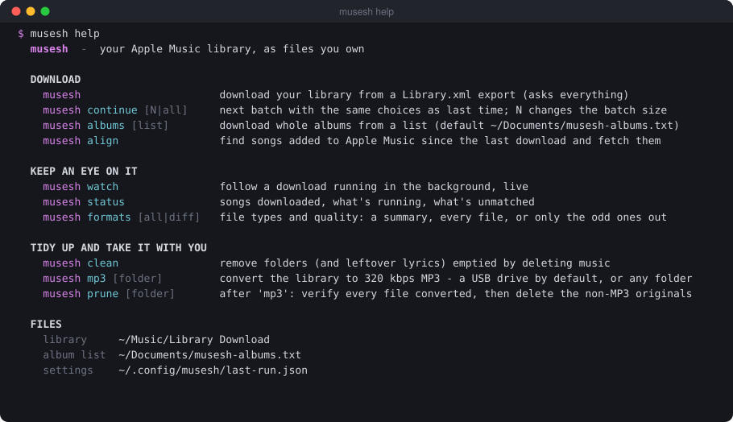
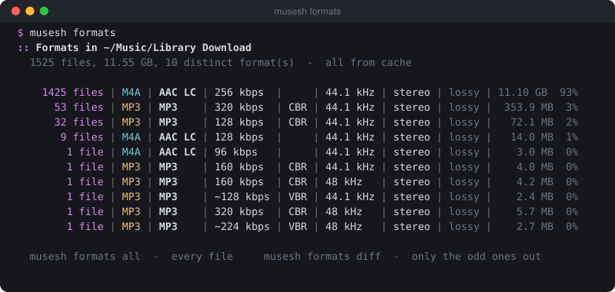

<div align="center">


# musesh

**Your Apple Music library, as files you own.**<br/>
Download it, keep it in sync, check its quality, and take it anywhere as MP3.

[](docs/setup.md)
[](docs/setup.md)
[](docs/setup.md#what-you-need)
[](https://github.com/glomatico/gamdl)
[](https://ffmpeg.org)

[**Setup**](docs/setup.md) &nbsp;/&nbsp; [**Commands**](docs/commands.md) &nbsp;/&nbsp; [**How it works**](docs/how-it-works.md) &nbsp;/&nbsp; [**Troubleshooting**](docs/troubleshooting.md)

<br/>



</div>

<br/>

## What it does

<table>
<tr>
<td width="50%" valign="top">

**The whole library, not just the easy part**<br/>
Point it at a `Library.xml` export. Apple Music tracks download as 256 kbps
AAC with tags and cover art; your own files (SoundCloud rips, purchases) are
copied as they are. Everything lands in one `Artist / Album` folder tree.

</td>
<td width="50%" valign="top">

**Exact matches, no guessing**<br/>
Songs are matched to Apple Music through your own cloud library first, so
most get their exact ID. Only leftovers go to a rate-limit-aware search, and
anything it can't place is listed in `unmatched.csv` rather than faked.

</td>
</tr>
<tr>
<td valign="top">

**Stays in sync, respects deletions**<br/>
`musesh align` finds only songs added since last time. Songs you deleted in
Swinsian or Finder are remembered and never come back. Two or more new songs
from one album? It offers the whole album, once.

</td>
<td valign="top">

**Whole albums from a text file**<br/>
Write `Miles Davis - Kind of Blue` or `my bloody valentine - * +eps` in a
list. It finds the right artist, prefers the original edition over deluxe
reissues, and shows every match before downloading.

</td>
</tr>
<tr>
<td valign="top">

**Knows what's on disk**<br/>
`musesh formats` reads every file's header in about a second: codec,
bitrate, CBR/VBR, sample rate, bit depth. A summary, every file, or just the
odd ones out.

</td>
<td valign="top">

**MP3 for the car, safely**<br/>
Mirror the library as 320 kbps MP3 to a USB drive (or any folder), with live
progress and a time estimate. Re-runs skip what's done and redo what's wrong;
`prune` only deletes originals after verifying every MP3 plays.

</td>
</tr>
</table>

<div align="center">

</div>

## Quick start

**1. Install the pieces** (macOS, Homebrew):

```sh
brew install pipx ffmpeg
pipx install gamdl
git clone https://github.com/Comiclyy/musesh.git ~/code/musesh
ln -s ~/code/musesh/musesh ~/bin/musesh      # any folder on your PATH
```

**2. Export two things:**

| | What | How |
| :-: | --- | --- |
|  | **Library.xml** | Music app: **File > Library > Export Library...** |
|  | **cookies.txt** | Log in at [music.apple.com](https://music.apple.com), export cookies in Netscape format (e.g. the *Get cookies.txt LOCALLY* extension) |

**3. Run it.** Every question has a default; press Enter to take it.

```sh
musesh              # pick the export, cookies, folder and batch size, then download
musesh continue     # the next batch, same choices, no questions
```

> [!TIP]
> Long download? `musesh watch` follows it live from any terminal, and
> `caffeinate -ims musesh continue` keeps the Mac awake until it's done.
> Everything is safe to stop with Ctrl-C and run again.

> [!IMPORTANT]
> musesh needs an **active Apple Music subscription** and is meant for keeping
> **your own library** for personal use. Downloading and decrypting streams may
> go against Apple's terms of service; that call is yours.

## Commands

| Command | Does |
| --- | --- |
| `musesh` | Download the library from a `Library.xml` export (in batches) |
| `musesh continue [N\|all]` | Next batch with the last run's choices; `N` changes the batch size |
| `musesh align` | Offer only songs added to Apple Music since the last download |
| `musesh albums [list]` | Download whole albums from a plain-text list |
| `musesh watch` / `status` | Follow a background download / see where things stand |
| `musesh formats [all\|diff]` | File types and quality: summary, every file, or the odd ones out |
| `musesh clean` | Remove folders (and leftover lyrics) emptied by deleting music |
| `musesh mp3 [folder]` | Mirror the library as 320 kbps MP3, to a USB drive by default |
| `musesh prune [folder]` | After `mp3`: verify every file, then delete the non-MP3 originals |

Every command, flag and prompt is in [Commands](docs/commands.md).

## Repository layout

<details>
<summary>Show the tree</summary>

```text
musesh            the CLI: menus, prompts, and every subcommand (stdlib Python)
library_dl.py     library download: Library.xml -> catalog IDs -> gamdl, batches, resume
albums.py         album lists: artist-first matching, edition preference, review, download
formats.py        header-only format scanner with a cache and a pager
mp3.py            MP3 mirror: plan, convert/redo/copy with progress, verify + prune
ui.py             shared terminal styling (colors off when piped or NO_COLOR is set)
library-dl        wrapper that runs library_dl.py with gamdl's Python
tools/            terminal-svg.py renders real command output into docs/images/*.svg
docs/             setup, commands, how it works, troubleshooting
examples/         a sample album list
```

</details>

Refresh the images in this README after changing any output:

```sh
tools/terminal-svg.py docs/images/help.svg "musesh help" --prompt --width 110 --lines 1:-1
tools/terminal-svg.py docs/images/formats.svg "musesh formats" --prompt --width 110 --lines 1:
```

<div align="center">
<br/>
<sub>Made for music libraries that deserve a proper folder.</sub>
</div>
