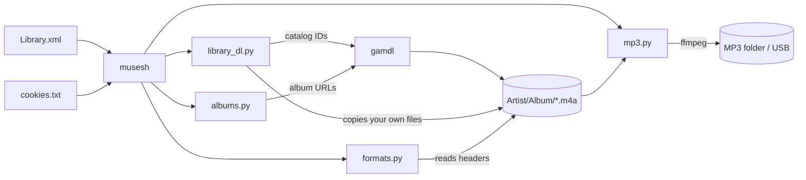

# How it works

There are five scripts behind the one command:

1. **`musesh`**: the CLI. Menus, prompts, remembered choices. Standard-library
   Python, so it starts instantly; it hands heavy work to the scripts below.
2. **`library_dl.py`**: downloads a library from a `Library.xml` export.
3. **`albums.py`**: resolves and downloads album lists.
4. **`formats.py`**: the format report.
5. **`mp3.py`**: the MP3 mirror and `prune`.

The last four run with the Python inside gamdl's pipx environment, which
already has gamdl, `httpx` and `mutagen`. Styling is shared through `ui.py`.

## Matching songs to Apple Music

A `Library.xml` export lists your songs by name, artist, album and length, but
not by their Apple Music catalog ID, which is what gamdl needs. musesh finds
the ID in two steps:

1. **Your cloud library.** With your cookies, musesh asks Apple Music for your
   own library (about 100 songs per request), which does carry catalog IDs. A
   song matches when the title and artist match (normalised: case, accents and
   punctuation ignored) and the length is within a few seconds. This places the
   large majority of songs exactly, in a couple of minutes.
2. **Catalog search**, only for what's left: songs whose details changed since
   you added them, re-released albums, or uploads. Candidates are scored on
   title, artist, album and length, and only a confident match is accepted.
   The public iTunes search API is used, paced at about one request every
   3 seconds and backing off when Apple says "too many requests".

Anything still unmatched goes to `unmatched.csv`. Nothing is guessed.

If a song's ID turns out to be dead (Apple answers 404, usually because the
album was re-released under a new ID), the ID is recorded in `gone.txt` and the
song is searched again, instead of counting as a failure.

## Batches, resuming and failures

- Finished songs are appended to `done.txt` as they complete, so any run can
  be stopped and resumed.
- A song that fails is retried in the next batch; after **2 failures** it's
  set aside (listed in `failures.json`) so it can't block the queue.
- If **5 songs in a row** fail, the run stops and blames the most likely cause,
  expired cookies, without counting those 5 against their retry limit.
- The login is checked before anything else. A cookies file that's missing,
  malformed, logged out or expired stops with a plain-English reason.

## What `align` considers new

Every song in an Apple Music library has a permanent **Persistent ID** that
appears in each export. `align` keeps every ID it has seen in `seen.json`:

- The first run records every ID in the export the library was downloaded
  from, as "already handled".
- After that, only IDs it has never seen are offered.

Deleting a file from the folder doesn't remove its ID from `seen.json`, which
is why deleted songs never come back. Songs you choose are downloaded from a
small export containing only them, so nothing else in the folder is touched
(the full downloader would otherwise re-copy your own files that you had
deleted). They're only marked as handled once their download finishes.

## Album lists

Each `Artist - Album` line is resolved **artist first**: find the artist
(exact-name matches win, and "&" equals "and"), then pick the album from that
artist's own catalog. That avoids same-named albums by other acts. When several
editions exist, the plain one wins over *Deluxe*, *Remastered* or *Expanded*,
then the one with the fewest tracks.

`Artist - *` uses Apple Music's own **Albums** section for the artist, which
leaves out live albums, compilations and box sets. `+eps` adds EPs from the
**Singles & EPs** section.

## Formats

`formats.py` reads only each file's header with `mutagen` (under a
millisecond per file), on several threads, and caches the results by path,
modification time and size. A first scan of ~1,500 files takes about a
second; repeats take a tenth of that.

## The MP3 mirror

For every song in the library, `mp3.py` decides what to do before starting,
by reading headers in the MP3 folder: skip it (already a 320 kbps MP3 of the
right length), convert it, redo it (wrong bitrate or cut short), or copy it
(already an MP3 in your library). Conversions run in parallel with ffmpeg
(`libmp3lame`, 320 kbps CBR, tags and cover art carried over), writing to a
`.part.mp3` file that's renamed into place only when complete.

`prune` goes further than a header check: it decodes every MP3 end to end,
which catches corruption that a correct-looking header would hide.

## Files on disk

| Path | Holds |
| --- | --- |
| `~/.config/musesh/last-run.json` | Last choices: export, cookies, library folder, MP3 folder, batch size |
| `~/.cache/musesh/formats.json` | Format scan cache |
| `<library>/.library-dl/matches.json` | Persistent ID to catalog ID (`""` = not in the catalog) |
| `<library>/.library-dl/done.txt` | Song and album URLs that finished |
| `<library>/.library-dl/failures.json` | Failure count per URL |
| `<library>/.library-dl/gone.txt` | Catalog IDs Apple answers with 404 |
| `<library>/.library-dl/seen.json` | Every Persistent ID `align` has seen |
| `<library>/.library-dl/albums.json` | Cached album-list lookups |
| `<library>/.library-dl/*.log` | Logs of background runs (`musesh watch` follows these) |
| `<library>/unmatched.csv` | Tracks that couldn't be found on Apple Music |
| `<mp3 folder>/.musesh/pruned-originals.txt` | MP3s whose original was pruned |
